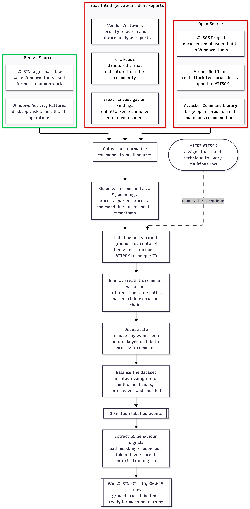

# WinLOLBIN-GT: A Behavioural Ground Truth Dataset for ML-Based Detection of Windows LOLBIN Abuse

WinLOLBIN-GT is a labelled behavioural ground truth dataset developed to support machine learning-based detection of Windows Living-Off-the-Land Binary abuse. The dataset was constructed using a controlled laboratory testbed in which benign administrative activity and malicious LOLBin execution patterns were generated, captured, validated, and labelled. Each event was designed to reflect realistic process execution behaviour, including command-line structure, parent-child process relationships, file paths, user context, and mapped behavioural indicators.

The dataset was used to train machine learning models for LOLBin abuse detection and was subsequently evaluated in a SIEM deployment setting. To assess generalisation, the trained model was tested on unfamiliar LOLBin attack scenarios not present in the training data. The deployed model correctly detected the unseen LOLBin attack activity with 99% accuracy, suggesting that the dataset can support both experimental model development and practical detection engineering.

The contribution of WinLOLBIN-GT is threefold: it provides a reproducible ground truth dataset for Windows LOLBin abuse detection, a controlled testbed methodology for generating labelled behavioural telemetry, and an evaluation framework for validating machine learning models in operational SIEM environments.

| | |
|--|--|
| Version | 1.0.1 |
| Scripts licence | [MIT](LICENSE) |
| Dataset licence | [CC BY 4.0](https://creativecommons.org/licenses/by/4.0/) — Zenodo files |
| **Download data** | **Zenodo** — [10.5281/zenodo.20533434](https://doi.org/10.5281/zenodo.20533434) |
| Processed rows | 10,006,645 (55 features + `model_text`) |
| Unprocessed rows | 10,000,000 (raw Sysmon-style events) |

## Dataset generation overview



## Generating the dataset

The scripts in this repository reproduce the full 10 million row dataset from scratch. Requires **Python 3.10+** and the auxiliary source files (LOLBAS catalogue and libLOL command library) — see [docs/generation-scripts.md](docs/generation-scripts.md) for full details.

**Step 1 — Generate raw labelled events**

Simulates 5 million benign and 5 million malicious Sysmon process-creation events, drawing commands from the LOLBAS catalogue, Atomic Red Team procedures, and the attacker command library. Each event carries a verified label and a MITRE ATT&CK technique ID.

```bash
cd scripts
python3 generate_winlolbin_gt_dataset.py --rows-per-class 5000000
```

Output: `winlolbin_gt_unprocessed_merged_10m.csv`

**Step 2 — Extract behaviour features**

Normalises the raw events, removes duplicates, masks paths and IPs, and derives 55 behaviour signals plus a `model_text` training field. Drops fields that would leak ground-truth information into model training.

```bash
python3 extract_lolbin_features.py
```

Default output locations (no flags needed):

| File | Location |
|------|----------|
| Processed CSV | `datasets/winlolbin_gt_processed_features_10m_plus.csv` |
| Manifest | `winlolbin_gt_processed_features_manifest.json` (repo root) |

To override the output paths:

```bash
python3 extract_lolbin_features.py \
  --output /custom/path/processed.csv \
  --manifest /custom/path/manifest.json
```

Output: `winlolbin_gt_processed_features_10m_plus.csv` — 10,006,645 rows, ML-ready.

Full column definitions: [docs/generation-scripts.md](docs/generation-scripts.md)

## Scripts

| Script | Role |
|--------|------|
| `generate_winlolbin_gt_dataset.py` | Main dataset builder — pulls commands from the LOLBAS API, the attacker command library (libLOL), and benign templates. Simulates realistic Sysmon process-creation events (process, parent, command line, user, host, timestamp) until it has 5 million unique benign and 5 million unique malicious rows, then merges and shuffles them. **Run this first.** |
| `winlolbin_parametric.py` | Uniqueness engine — when LOLBAS and libLOL templates run out of new unique commands, this generates structurally distinct command-line variations using index-based suffixes. Allows the dataset to scale to 10 million rows without duplicates. Imported by the main generator, not run directly. |
| `lolbin_features.py` | Feature definitions library — defines all 55 behaviour signals: path and IP masking, URL and base64 detection, suspicious token flags, parent-child process context counts, and the deduplication key logic. Imported by the extraction script, not run directly. |
| `extract_lolbin_features.py` | Feature extraction — reads the raw 10M merged CSV, deduplicates everything, applies all 55 feature definitions, adds the `model_text` training field, drops fields that would leak ground-truth into a model (host, username, attack rationale), and writes the final ML-ready CSV. **Run this second.** |
| `build_winlolbin_gt_dataset_artifacts.py` | Packaging helper — splits the finished processed CSV into per-class files and writes 500-row sample preview files for the Zenodo upload. Not needed to reproduce the full dataset. |

## Data sources and acknowledgements

WinLOLBIN-GT is built on top of a number of open community resources. We gratefully acknowledge their work.

**[LOLBAS Project](https://lolbas-project.github.io/) — primary source**
The Living Off The Land Binaries and Scripts project ([github.com/LOLBAS-Project/LOLBAS-Project.github.io](https://github.com/LOLBAS-Project/LOLBAS-Project.github.io)) is the foundation of this dataset. Every binary documented in the LOLBAS catalogue is represented in WinLOLBIN-GT — both its known abuse patterns (malicious class) and its legitimate administrative use (benign class). The dataset would not exist without this community effort.

**[Atomic Red Team](https://github.com/redcanaryco/atomic-red-team) — attack procedures**
Red Canary's Atomic Red Team library provides concrete, technique-level attack test procedures mapped directly to MITRE ATT&CK. These procedures informed the malicious command patterns and parent-child execution chains in the dataset.

**[MITRE ATT&CK](https://attack.mitre.org/) — technique labels**
Every malicious event in WinLOLBIN-GT carries a MITRE ATT&CK technique ID and tactic. ATT&CK is the authoritative taxonomy that makes the labels consistent and comparable across the research community.

**Threat intelligence and incident reports**
Publicly available vendor write-ups, CTI feeds, and breach investigation findings were used to validate and extend malicious command patterns, ensuring coverage of techniques observed in real-world attacks.

## Citation

```bibtex
@dataset{winlolbin_gt_2026,
  title   = {WinLOLBIN-GT: A Behavioural Ground Truth Dataset for Machine Learning-Based Detection of Windows Living-Off-the-Land Binary Abuse},
  author  = {Daniel Jeremiah and Husnain Rafiq and Obinna Okoyeigbo},
  year    = {2026},
  version = {1.0.1},
  doi     = {10.5281/zenodo.20533434}
}
```
