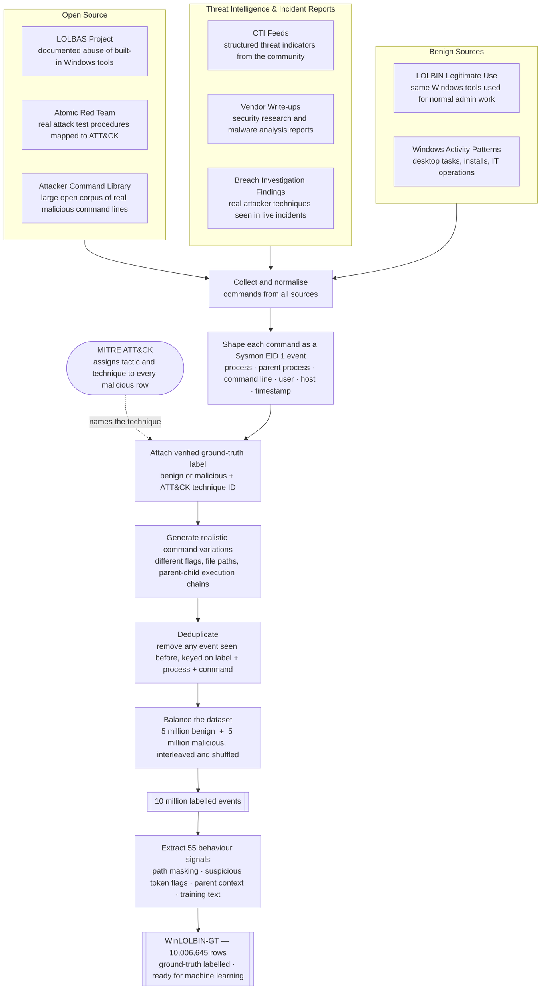
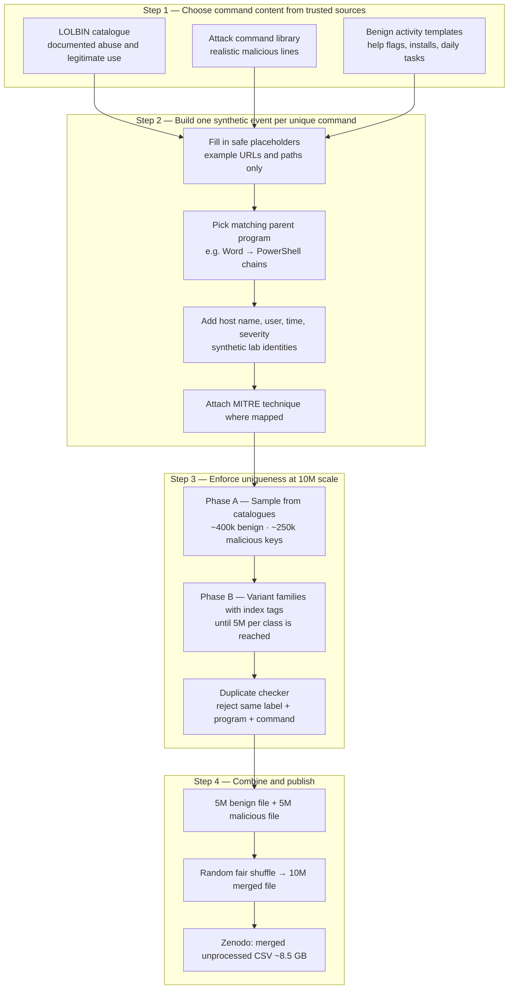
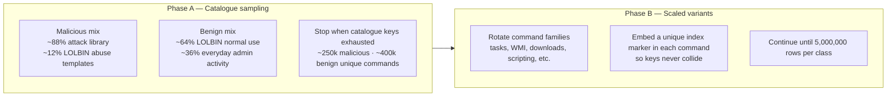
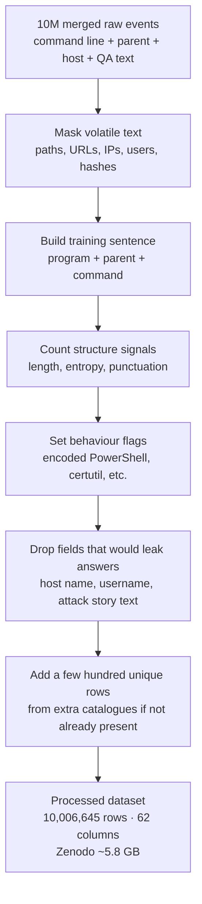
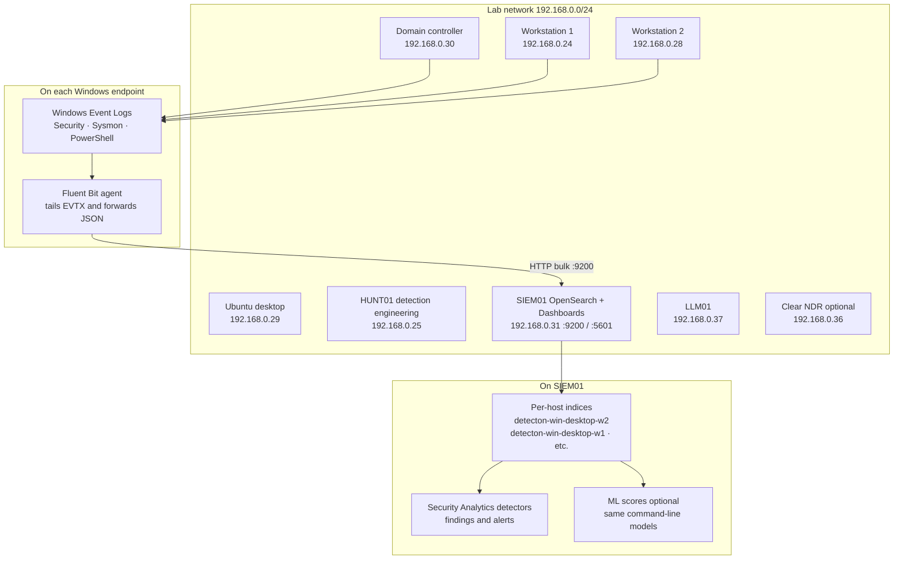
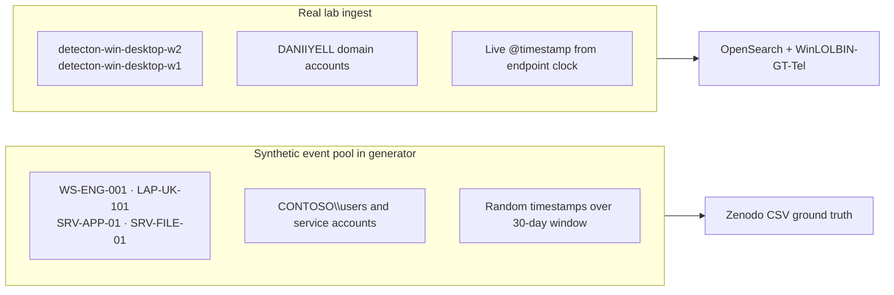
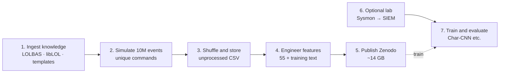

# WinLOLBIN-GT — how the dataset is built

Audience-friendly diagrams for the **10 million row ground-truth dataset**. Live lab topology (Sysmon → OpenSearch) is in **section 5**.

Export figures from [mermaid.live](https://mermaid.live). Recommended for papers and README: **1**, **2**, **3**, **5**.

Script details: [generation-scripts.md](generation-scripts.md).

---

## 1. Big picture — how WinLOLBIN-GT ground truth is built

Every event mirrors a real **Sysmon process-creation (EID 1)** record. Labels come from the trusted knowledge each command originates from — ground truth, not inference.

Each malicious row traces to a documented real-world technique. Each benign row traces to a known legitimate Windows task.

---

## 2. How we reach 10 million labelled events

Each row is one **process start** (Sysmon Event ID 1 style): who ran what command, from which parent program, on which lab-style host.

**Why 10,006,645 processed rows (not exactly 10M)?**  
After the 10M simulation, a small set of **extra unique rows** from supplementary catalogues is added during feature extraction (645 rows in the v1.0.1 build). The Zenodo manifest lists exact counts.

**Uniqueness rule (plain language):**  
Two rows are considered the same if they share the same **benign or malicious label**, the same **program name**, and the same **normalized command text** (paths and URLs masked so host-specific spelling does not create fake diversity).

---

## 3. Phase A and Phase B — filling 5 million per class

| Phase | Audience summary |
|-------|------------------|
| **A** | Reuse **realistic command text** from public LOLBIN docs, the attack library, and benign templates. |
| **B** | When the catalogues would repeat, **generate fresh command lines** from rule-based families until five million unique lines exist per class. |

---

## 4. From raw simulated events to the ML table

**What is removed before ML export (on purpose):**  
Fields like **attack story**, **host name**, and **username** stay in the **unprocessed** Zenodo file for human review but are **not** copied into the processed training file, so models learn from **behaviour**, not from memorizing `WS-ENG-001` or `CONTOSO\user`.

---

## 5. Detecton lab — where live Sysmon logs come from

This is **separate** from the 10M CSV build, but it shows how the same kind of event (process create) is collected on real machines in the lab.

| Lab asset | IP (example) | Role |
|-----------|----------------|------|
| SIEM01 | 192.168.0.31 | Stores logs; Dashboards UI port 5601 |
| Domain controller | 192.168.0.30 | AD DNS lab; optional IIS |
| Workstation 1 | 192.168.0.24 | Member PC; Sysmon + Fluent Bit |
| Workstation 2 | 192.168.0.28 | Member PC; e.g. index `detecton-win-desktop-w2` |
| HUNT01 | 192.168.0.25 | Velociraptor, Caldera, Jupyter |
| Ubuntu desktop | 192.168.0.29 | Linux logs → `detecton-linux-*` (separate indices) |

**Shipping path:** Sysmon writes **process creation** events → Fluent Bit reads channels → JSON documents POST to **OpenSearch** on SIEM01 → one index slug per hostname.

---

## 6. Synthetic hosts vs real lab hosts

Synthetic CSV rows use **fictional workstation names and users** (for example `WS-ENG-001`, `CONTOSO\ajones`) drawn from a fixed pool so the dataset is safe to share.  
Live OpenSearch documents use **real lab host slugs** from actual machine names.

---

## 7. Source catalogue — friendly names mapped to build role

| What readers see | What it provides | Used in |
|------------------|------------------|---------|
| **LOLBIN command catalogue** | Official list of Windows programs and example command lines | Malicious and benign simulation |
| **Attack command library** | Long-form realistic attack commands and narratives | Mostly malicious simulation (~88% of early malicious draws) |
| **Benign activity templates** | Ordinary admin and user workflows | Benign simulation (~36% of early benign draws) |
| **MITRE ATT&CK** | Technique IDs (e.g. PowerShell execution, ingress tools) | Tags on both synthetic and live-oriented rules |
| **Supplementary row catalogues** | Small extra JSON/CSV sources | Only at feature step; skips duplicates |
| **Safe URL policy** | Documentation-only network addresses (RFC 5737) | All synthetic downloads in CSV |

No live attacker infrastructure is embedded in the synthetic files.

---

## 8. End-to-end timeline (recommended slide order)

---

## 9. Row counts reference (v1.0.1)

| Stage | Benign | Malicious | Total |
|-------|--------|-----------|-------|
| Per-class simulation target | 5,000,000 | 5,000,000 | — |
| Merged unprocessed (Zenodo) | 5,000,000 | 5,000,000 | **10,000,000** |
| Processed with features (Zenodo) | — | — | **10,006,645** |
| Live labelled telemetry (separate) | 16,727 | 15,000 | 31,727 |

---

## Related diagrams

Broader ML and Char-CNN architecture: `Research_Paper/01-dataset-paper/architecture-diagrams.md` in the monorepo.
